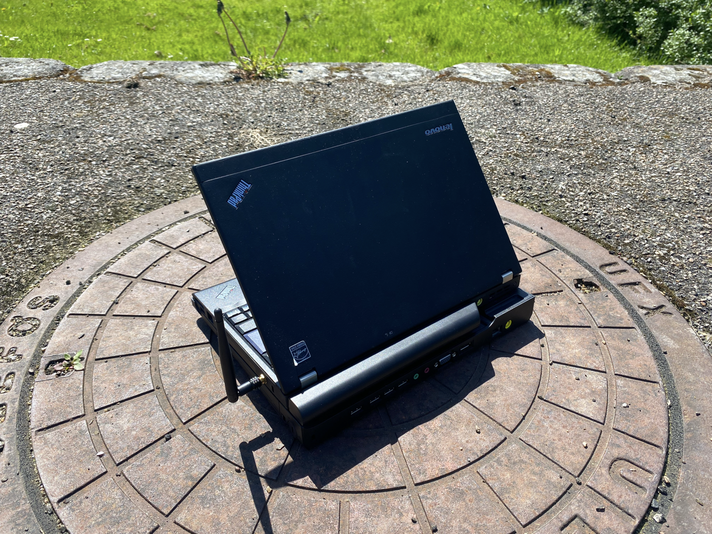
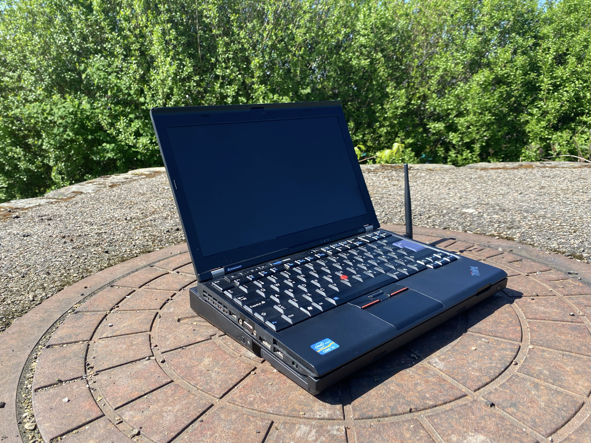

<h1 align='center'>My x220</h1>

This is a compiled repo of mods and software i run

**Stuff done so far:**
* **Antenna mod**
* **16Gb RAM**
* **Dual SSD / Dual Boot**
* **9 Cell Battery**
* **Metal Liquid**

**Stuff 2do:**
* **IPS 2K 2560*1600 13.3" Display mod**
* **Red ThinkLight mod**
* **USB C PD**
* **Internal USB** - attach RTL8812AU. 
* **Wifi chipset mod (AX210HMW)**
* **Firmware flash - coreboot or custom**
* **Remove Management Engine**
* **Meta Keycap replacement(remove windows logo)**
* **Speaker mod - Samsung note 10 or Ipad 11" pro speakers**
* **Quad core mod ie - Intel Core i7-3615QE (kill me..)**

**Software i run:**
* **OS** - NixOS Linux and Windows11Pro
* **DWM**
* **Kitty**
* **Vim**
* **Ly**
